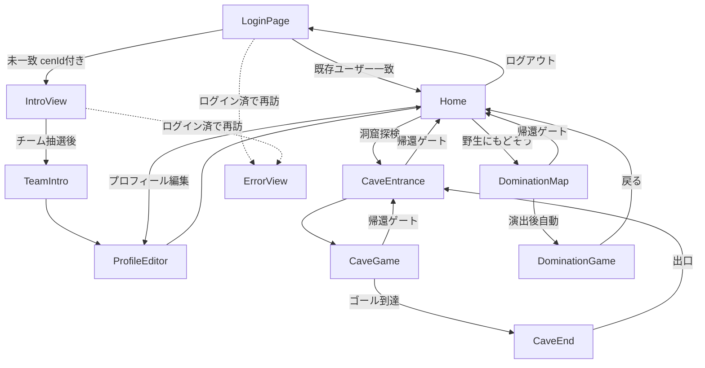

# cave-adventure 全体要件定義書

- 対象プロジェクト: `cave-adventure`（Vue3製ゲーミフィケーションアプリ）
- 作成日: 2026-09-19
- 作成者: Claude Code（安藤氏との調査・すり合わせをもとに作成）
- 元ネタ: Googleスプレッドシート「ゲーミフィケーション詳細設計」シート（フローチャート形式の簡易設計書）＋ 現行実装コードの調査結果

> このドキュメントは全体像を把握するための「概要要件定義書」です。各画面・各モードの詳細な要件定義書は本ドキュメントの内容をもとに、別途スコープを決めて作成します（末尾「今後作成予定のドキュメント」参照）。

---

## 1. 概要・目的

来場者（プレイヤー）が配布された固有ID（`cenId`）でログインし、モニタールームを起点に2種類のミニゲーム（洞窟探検ゲーム／陣取りゲーム）を楽しみながら、チーム対抗でコンテンツを進めていくゲーミフィケーション企画。

- 水・土・空気の3チームに振り分けられ、チーム対抗で「生きものカード」を集めたり、フィールドを取り合ったりする。
- 洞窟探検ゲームで集めたカードを使って、陣取りゲームでエリアを取り合う、という2ゲーム間の連携が設計上のコンセプトになっている。

## 2. 対象ユーザー・利用シーン

- 事前に `cenId`（バッジ／QRコードなどで配布想定）を持つ来場者。パスワード等による本人認証は行わない前提（詳細は5章参照）。
- イベントや施設内での利用を想定（PC/タブレット等のブラウザで動作。モバイル専用最適化はされていない）。

## 3. システム構成

| 項目 | 内容 |
|---|---|
| フロントエンド | Vue 3（Options API） + vue-router 4、`@vue/cli-service` でビルド |
| 状態管理 | Vuex/Pinia等の専用ストアは無し。全て `localStorage` ベースの簡易セッションで管理 |
| バックエンド | 専用APIサーバーは無し。クライアントから直接 Firebase Firestore を参照・更新 |
| 認証 | Firebase Authは未使用。`cenId` によるFirestore照合のみ（パスワード無し） |
| 地図 | Leaflet（陣取りゲーム導入画面 `DominationMap` で使用） |
| アバター生成 | `@multiavatar/multiavatar`（6パーツのコードから決定的にSVGアバターを生成） |
| スタイリング | Tailwind（CDN読み込み）＋ 各画面のscoped CSS |
| デプロイ | Netlify。`main` ブランチが直結デプロイされているため、作業は必ず別ブランチで実施 |

## 4. 画面一覧・画面遷移図

| ルート | 画面名（route name） | 概要 |
|---|---|---|
| `/loginPage` | LoginPage | `cenId` によるログイン |
| `/intro` | Intro | 新規プレイヤーの導入（動画＋チーム振り分け） |
| `/teamIntro` | TeamIntro | チーム紹介（読み物） |
| `/settings/profile-editor` | ProfileEditor | 名前・アバター設定 |
| `/`（`/monitor-room`はリダイレクト） | Home | モニタールーム（起点となるハブ画面） |
| `/cave-adventure/cave-entrance` | CaveEntrance | 洞窟探検：導入 |
| `/cave-adventure/cave-game` | CaveGame | 洞窟探検：本編（迷路ゲーム） |
| `/cave-adventure/cave-end` | CaveEnd | 洞窟探検：カード獲得（ガチャ的な演出） |
| `/dominationMap` | DominationMap | 陣取りゲーム：導入（地図） |
| `/dominationGame` | DominationGame | 陣取りゲーム：本編 |
| `/error` | Error | エラー画面（現状の用途は8章参照） |
| ― | Recruitment | **未実装**（空ファイル、ルート未登録） |

### 画面遷移図

## 5. ログイン・セッションの仕様

**2026-09-24に仕様変更。詳細は [01_login.md](01_login.md) を参照。**

- 会員の実体は外部サイト `ce-n.org`（子ども環境ネットワーク）側にあり、このアプリは`ce-n.org`からの`?cenId=`付きリンクで入ってくる前提に変更。手入力フォームは廃止し、ログイン画面はローディング表示のみ
- ログイン判定は2段階：①`ce-n.org`の`findMe` APIで会員として実在するか　②Firestore `users`コレクションでこのゲームに登録済みか
- セッションは`localStorage`の5キーで管理（`loginCenId`/`playerData`/`myTeam`/`playerUid`/`loginDate`）。`loginDate`はMonitorRoom訪問ごとに更新され、7日以上更新が無いと自動ログアウトする
- MonitorRoomの「ゲームを終了する」（旧ログアウト）は、ログアウト後に`ce-n.org`の会員プロフィールページへリダイレクトする
- ルーターガード（`src/router/index.js`）: `loginCenId` が無ければ保護ルートから `LoginPage` へリダイレクト。逆に `loginCenId` がある状態で `LoginPage`/`Intro` に来ると `Error` へリダイレクトする（この部分は変更なし）

## 6. データモデル概要（Firestore）

- `users/{uid}`: `uid, name, avatar{env,clo,head,mouth,eyes,top}, team, cards[], level, coins, createdAt, cenId, enteredMonitorRoomAt`
- `teams/{teamId}`（`water`/`earth`/`air`）: `members[]`（`arrayUnion` で追加）

いずれもクライアントから直接読み書きしており、バックエンドAPI・Cloud Functions等の中間層は無い。

## 7. ゲームルール概要

詳細は既存スプレッドシート「ゲーミフィケーション詳細設計」を参照。ここでは要点のみ記載する。

### 7.1 モニタールーム（ハブ）
ログイン後の待機場所。洞窟探検／陣取り（野生復帰）ゲームの選択、チーム情報・保有カード数などの確認ができる。

### 7.2 洞窟探検ゲーム（CaveEntrance → CaveGame → CaveEnd）
- マウスで移動し、迷路内の4色の鍵を集めてゴールを目指す探索ゲーム。
- 鍵を2つ集めると敵が出現して追いかけてくる（捕まると自宅位置に戻される＝ソフトペナルティ、ゲームオーバーはない）。
- ワープ地点を踏むと別テーマの迷路に切り替わる。
- ゴール到達で「生きものカード」ガチャ（CaveEnd）に進み、集めた鍵の数だけカードを引ける。

### 7.3 陣取りゲーム（DominationMap → DominationGame）
- 地図（平塚市／釧路市）から舞台を選ぶ導入演出の後、本編へ。
- 3チーム（水・土・空気）が「生きものカード」をフィールドのマス目に配置して縄張りを取り合うターン制ゲーム。
- カードには階層（レベル1〜4）があり、レベル2以上は隣接する一段階下のカードが2つ以上必要（食物連鎖的な配置制約）。
- 配置時に隣接する下位カードは「食われる」扱いになり、盤面の色が配置チームの色に変わる。
- 手札が尽きる／全員パス／手動終了でゲーム終了、チームごとの得点で勝敗を表示。

## 8. 既知の課題・未実装機能一覧

要件定義・今後の開発方針を検討する上での材料として、調査で判明した現状の課題・未実装箇所を記載する。

| 項目 | 内容 |
|---|---|
| `Recruitment` 画面 | ファイルが空。ルート未登録。未実装のプレースホルダー |
| モニタールームの「生きもの修復」 | ボタンは表示されるが無効化・コメントアウトされており未実装 |
| モニタールームの「生き物スキャン」 | 画面・外部API連携は実装済みだが、2026-09-24時点でボタンをコメントアウトして非表示（公開判断待ち）。詳細は [03_creature_scan.md](03_creature_scan.md) 参照 |
| ~~陣取りゲームの永続化~~ | **2026-09-19に対応済み。** `dominationGames/{ルームコード}` にFirestore保存され、離脱・再訪しても再開できる。AI操作(2チーム)追加、UI刷新も実施。詳細は [02_domination_game.md](02_domination_game.md) 参照 |
| チーム別専用ルーム（`goTeamRoom`） | スタブ止まりで未実装 |
| `collection`（洞窟探検で集めたカード）の永続化 | **現状は `localStorage` のみで管理されており、Firestoreに保存されていない。** ブラウザ/端末を変えると消える。安藤氏より「ちゃんとFirestoreに保存する必要がある」との課題認識あり。対応方針は別途検討・実装予定 |
| ログアウト処理での `collection` 未クリア | `MonitorRoom.logout()` も今回の `ErrorView` のログアウト処理も、`collection` キーはクリアしていない（上記Firestore移行と合わせて整理が必要） |
| `playerUid` のセット漏れ | 新規登録（IntroView）ではセットされるが、既存ユーザーの通常ログイン（LoginPage）ではセットされない |
| `CaveEnd` のカードデータ | カードIDに `"dragon"` が複数のカードで重複しており、抽選確率が意図とズレている可能性 |
| `ErrorView` の役割 | 現状は「ログイン済みユーザーが `/loginPage` や `/intro` に再訪した場合」のみ到達する画面で、汎用的なエラーハンドリング（想定外エラーのキャッチ）としては機能していない。ログアウト処理を追加する場合は、この画面の到達経路を踏まえて設計する必要がある |
| Font Awesome未読込 | `CreatureCard.vue` がFont Awesomeのクラスでアイコンを表示しようとしているが、`index.html` にCDN読み込みが無く表示されない可能性 |

## 9. 今後作成予定のドキュメント（候補）

以下は画面・モード別の詳細要件定義書の候補。どれを作るか・優先順位は別途相談して決定する。

- モニタールーム（ハブ画面）要件定義書
- ~~ログイン／新規登録（LoginPage・IntroView・TeamIntro）要件定義書~~ → [01_login.md](01_login.md) 作成済み（LoginPage部分のみ。IntroView/TeamIntroの詳細は未着手）
- プロフィール編集（ProfileEditor）要件定義書
- 洞窟探検ゲーム（CaveEntrance / CaveGame / CaveEnd）要件定義書
- ~~陣取りゲーム（DominationMap / DominationGame）要件定義書~~ → [02_domination_game.md](02_domination_game.md) 作成済み
- ~~生き物スキャン（CreatureScan）要件定義書~~ → [03_creature_scan.md](03_creature_scan.md) 作成済み
- ~~カード収集・所持データ（`collection`）のFirestore移行 要件定義書~~ → [04_cards.md](04_cards.md) 作成中（たたき台）
