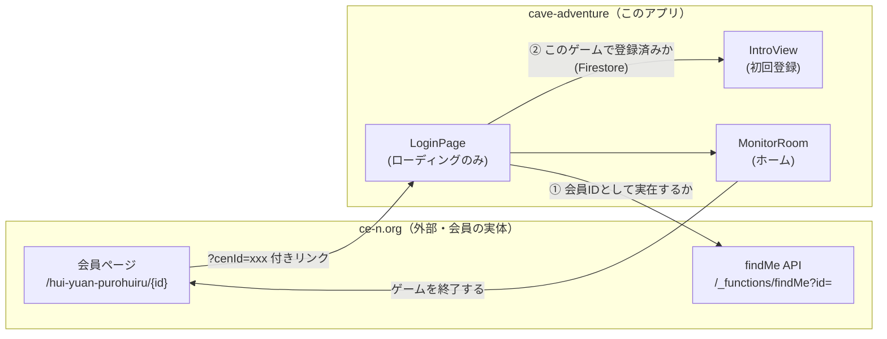

# ログイン・セッション管理 要件定義書

- 対象: `LoginPage.vue` / `router/index.js` / `MonitorRoom.vue`（セッション部分）
- 作成日: 2026-09-24
- 位置づけ: [00_overview.md](00_overview.md) の詳細版（ログイン・セッション管理部分）。2026-09-19〜09-24の変更を反映した最新仕様

---

## 1. 概要・目的

このアプリ単体では会員登録を行わない。**会員の実体は外部サイト `ce-n.org`（特定非営利活動法人 子ども環境ネットワーク）側にあり**、このアプリは「`ce-n.org`の会員が、ゲーム部分だけをプレイしに来る」ための付随アプリという位置づけになっている（2026-09-24変更）。

そのため、ログインは「ユーザーがIDを手入力する」ものではなく、**`ce-n.org`から`?cenId=...`付きのリンクを踏んで自動的に入ってくる**ことを前提にしている。

## 2. 全体アーキテクチャ



- **ce-n.org**: 会員の本体データを持つ。会員ID（`cenId`）の実在確認は `GET https://www.ce-n.org/_functions/findMe?id={cenId}` で行う。見つからない場合は `{"message": "..."}` を含むJSONが返る。
- **Firestore (`users`コレクション)**: このゲームアプリ独自のプレイヤーデータ（アバター・チーム・カード等）。`cenId`をキーに、このゲームで初回登録済みかどうかを判定する。ce-n.orgの会員データとは別物。

## 3. ログイン画面（LoginPage）の仕様

**2026-09-24に「手入力フォーム」を廃止し、ローディング表示のみに変更した。** 通常のユーザーがこの画面の実体（フォーム）を目にすることは無い。

### 画面の状態
| 状態 | 表示 |
|---|---|
| 確認中 | スピナー＋「よみこみ中...」のみ |
| 通信エラー時のみ | エラーメッセージ＋「ce-n.orgにもどる」ボタン |

### 処理フロー（`mounted()`）

1. URLクエリパラメータ `cenId` を取得する
2. **`cenId`が無い場合** → 即座に `https://www.ce-n.org/` へリダイレクト（このアプリを`cenId`無しで直接訪れることは想定していない）
3. **`cenId`がある場合** → `checkUser(cenId)` を自動実行する

### `checkUser(cenId)` の判定順序

1. **ce-n.org会員として実在するか確認**
   `GET https://www.ce-n.org/_functions/findMe?id={cenId}`
   - レスポンスに `message` フィールドが**ある** → 会員として存在しない → `Error`画面へ遷移（2026-09-24変更。以前は`https://www.ce-n.org/`へ即リダイレクトしていたが、エラー画面を経由するように変更）
   - `message` フィールドが**無い** → 実在する会員。次のステップへ
2. **このゲームでの登録有無を確認（Firestore）**
   `db.collection("users").where("cenId", "==", cenId)`
   - **1件でも見つかった**（＝このゲームで遊んだことがある） →
     - `localStorage` に `loginCenId` / `playerData` / `myTeam` をセット
     - `Home`（MonitorRoom）へ遷移
   - **見つからない**（＝ce-n.org会員だがこのゲームは初めて） →
     - `Intro`（新規登録・チーム分け動画）へ、`cenId`をクエリで引き継いで遷移
3. **通信エラー時**（fetch/Firestoreの例外） → エラーメッセージを表示し、「ce-n.orgにもどる」ボタンのみ提示（再入力フォームは無いため、やり直しはce-n.org側から再度リンクを踏んでもらう想定）

> ⚠️ **開発上の注意**: この判定順序のため、ce-n.orgに実在しないテスト用ID（例: `test0826-1`）ではログインできない。動作確認には実在する会員IDが必要。

## 4. セッション管理（localStorage）

| キー | 内容 | セット箇所 | クリア箇所 |
|---|---|---|---|
| `loginCenId` | ログイン中のcenId。ルーターガードの認証フラグ | LoginPage / IntroView | logout / endGame |
| `playerData` | プレイヤー情報のJSONキャッシュ | LoginPage / IntroView / ProfileEditor | logout / endGame |
| `myTeam` | 所属チーム（water/earth/air） | LoginPage / IntroView / TeamIntro | logout / endGame |
| `playerUid` | FirestoreドキュメントID（新規登録時のみセット。既存ログインではセットされない、既知の課題） | IntroView | logout / endGame |
| `loginDate` | 最終アクセス日時（epoch ms文字列）。7日セッション失効の基準（2026-09-24追加） | MonitorRoom `mounted()` 毎回 | logout / endGame |

### 7日間セッション失効（2026-09-24追加）

MonitorRoom（ホーム画面）に来るたびに、`checkSessionExpired()` が以下を行う。

```
storedLoginDate = localStorage.loginDate

if storedLoginDate があり、かつ (今 - storedLoginDate) > 7日:
    logout() を実行して終了（MonitorRoomの以降の処理はスキップ）
else:
    localStorage.loginDate = 今 に更新して続行
```

- **7日のカウントは「最後にMonitorRoomを開いた日時」からの経過日数**。MonitorRoomを開くたびにリセットされるため、7日以内に一度でもホームへ戻れば継続してログイン状態を維持できる。
- MonitorRoom以外の画面（洞窟探検中や陣取りゲーム中など）に長時間いても、この期限チェックは走らない（MonitorRoomの`mounted()`にのみ実装されているため）。

## 5. ログアウト／ゲーム終了

`MonitorRoom.vue` 内に2つの経路がある。

### `logout()` — 自動ログアウト用
7日セッション失効時に内部的に呼ばれる。localStorageの上記5キーを全て削除し、`LoginPage`へ遷移する。

### `endGame()` — 「ゲームを終了する」ボタン（プロフィールメニュー内）
2026-09-24に「ログアウト」ボタンから名称・挙動を変更。

1. `cenId`を保持（`currentPlayerData.cenId`、無ければ`localStorage.loginCenId`から）
2. localStorageの5キーを全て削除（ログアウト処理そのものは`logout()`と同じ）
3. `https://www.ce-n.org/hui-yuan-purohuiru/{cenId}`（ce-n.org側の会員プロフィールページ）へリダイレクト
   - このURLパスはce-n.org（Wix製サイト）が「会員プロフィール」ページから自動生成したスラッグで、想定通りの正しいパス（実際の会員IDで動作確認済み）

## 6. ルーターガード（`src/router/index.js`）

```
if to が "Error":
    常に許可（未ログイン状態でも表示できる必要があるため。2026-09-24追加）

publicRoutes = ["LoginPage", "Intro"]

if to が publicRoutes に含まれる:
    loginCenId がある → Error画面へ（ログイン済みなのに公開ページに来たため）
    無ければそのまま通す
else（保護ルート）:
    loginCenId が無ければ LoginPage へ
    あればそのまま通す
```

この結果、**`?cenId=`無しで保護ルート（ホーム等）に未ログインでアクセスすると、LoginPage → （cenId無し判定）→ ce-n.orgへ即リダイレクト**という経路になる（LoginPageの空フォームが表示されることはない）。

### ErrorViewの役割（2026-09-24拡張）

以前は「ログイン済みユーザーが`LoginPage`/`Intro`に再訪した場合」のみ到達する画面だったが、**「`findMe`で存在しないcenId」の到達先としても使われるようになった**（未ログイン状態での到達を許可する必要があるため、上記ルーターガードの特別扱いを追加）。

- `mounted()`でセッション用localStorageの5キー（`playerUid`/`playerData`/`myTeam`/`loginCenId`/`loginDate`）をクリアする
- 画面上のボタンは「ce-n.orgにもどる」。クリックで`window.location.href = "https://www.ce-n.org/"`（SPA内遷移ではなく外部への直接リダイレクト）

## 7. 既知の課題・注意点

| 項目 | 内容 |
|---|---|
| テストIDが使えない | ce-n.orgの`findMe`で実在確認するため、ce-n.org側に存在しないダミーIDでは一切ログインできない。開発・QAには実在の会員IDが必要 |
| `playerUid`のセット漏れ | 既存ユーザーの通常ログインでは`playerUid`がセットされない（00_overview.md既出の課題、未対応のまま） |
| 7日判定はMonitorRoom限定 | ミニゲーム中など、MonitorRoomを経由しない長時間セッションでは失効チェックが走らない |
| findMe通信失敗時の扱い | ネットワークエラー時は一律「確認に失敗しました」表示のみ。ce-n.org側が落ちている場合の区別は無い |
| 同時多重リクエスト | `checkUser`に多重実行防止のガードが無い（通常は`mounted()`から1回のみ呼ばれるため実害は薄い） |
